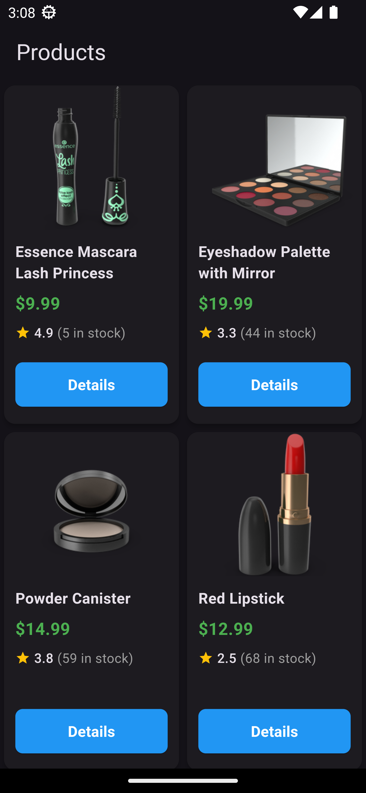
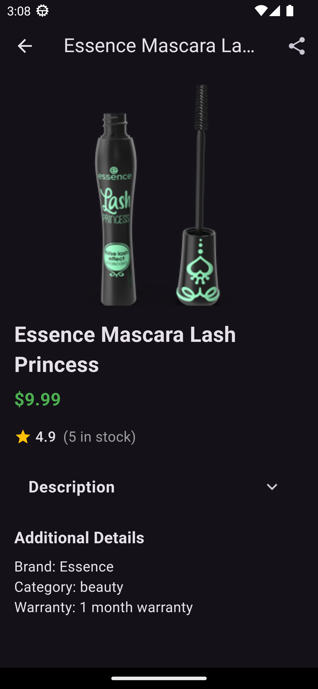

# Stepx Task

## Overview

This is a Flutter application developed for the **Stepx Flutter Technical Assessment**. The project demonstrates best practices in modern Flutter development, including API integration, state management, and UI responsiveness.

## Features

- **Product Listing** with Grid/List view toggle
- **Search functionality**
- **Pull-to-refresh** implementation
- **Basic filtering**
- **Product Detail Page** with an expandable description and share functionality
- **Navigation & Routing** with route guards for authenticated routes
- **API Integration** with proper error handling and loading states

## Technologies Used

- **Flutter** (latest stable version)
- **Dio** for API integration
- **BLoC** for state management
- **Flutter ScreenUtil** for responsive UI
- **Pull to Refresh** for list refresh functionality
- **Share Plus** for sharing content
- **URL Launcher** for opening links
- **Freezed** for data classes and immutability
- **Json Serializable** for JSON parsing
- **Json Annotation** for model annotation

## Screenshots

### Phone Products Screen





## Installation & Setup

1. Clone the repository:
   ```sh
   git clone https://github.com/yourusername/stepx_task.git
   ```
2. Navigate to the project directory:
   ```sh
   cd stepx_task
   ```
3. Install dependencies:
   ```sh
   flutter pub get
   ```
4. Run the project:
   ```sh
   flutter run
   ```

## State Management

This project utilizes **Flutter BLoC** for managing state efficiently. BLoC ensures a clear separation of concerns and maintains a scalable architecture.

## Project Structure

```
stepx_task/
│-- lib/
│   │-- main.dart
│   │-- models/
│   │-- utils/
│   │-- views/
│   │-- services/
│   │   │-- service/
│   │   │-- repos/
│-- pubspec.yaml
│-- README.md
```

## API Integration

The application fetches product data from **dummyjson.com/products** using **Dio** for handling network requests. Proper error handling ensures a smooth user experience.

## Additional Notes

- Implemented a **clean architecture** approach
- **Error handling** and **loading states** are well managed
- Designed with a **responsive UI**
- Followed best practices in **code organization** and **reusability**

## How to Contribute

1. Fork the repository.
2. Create a new branch: `git checkout -b feature-branch`
3. Commit your changes: `git commit -m "Add new feature"`
4. Push the branch: `git push origin feature-branch`
5. Open a pull request.

## License

This project is licensed under the MIT License.
